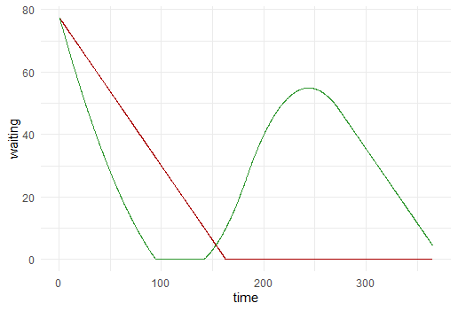

A 'How to' guide to create a system dynamics model interface using open source software.

Takes an already-developed model built using Stella Architect (but the method is also applicable to models built in other software that follows the XMILE convention), and interacts with it in `R`, using the `reticulate` package to harness the power of the `ASDM` package developed for Python by [Wang Zhao](https://github.com/wzh1895).

The `ASDM` package also has the ability to build from scratch but this guide does not cover that.

## Overview

The `reticulate` package allows you to run Python code in R. Python is more explicit than R about environments, and this can be tricky to navigate for a someone not familiar with Python. Therefore this guide will start with a light touch, using the default environment created when you install `reticulate`. It will then give details about how to set up a dedicated environment for each project, which will be necessary if you plan to build and deploy a `Shiny` app.

This guide takes a simple capacity-constrained Stella model, then uses the functionality of the ASDM package to load it into R, adjust parameters and run some simulations. These simulations are the equivalent of running the model in 'Stella Live' mode.The three inputs that the user will be able to adjust are coloured green: 'referrals per week' is a discrete graphical function (currently all values are 20), whilst 'total places' and 'length of service wks' are single values. If you have access to Stella, run this model so you can compare results.

### Initial Setup

All code is in `R` and can be worked from R Studio IDE, which avoids having to run commands in the terminal (which Python documentation tends to rely on).

Start by loading R libraries, and installing `reticulate`:

```{r libraries}
library(dplyr)
library(janitor)
library(ggplot2)

if(!require(reticulate)){
  install.packages("reticulate")
  }
```

At this stage just be aware that this will have created a virtual environment called `r-reticulate`.

Next is to check which version of Python you have installed:

```{r python-version}
library(reticulate)

py_config()
```

If you don’t have any versions of Python on your computer, you can install it using `install_python()`. If you need a specific version of Python insert it in the brackets, e.g.: `install_python("3.11")`

```{r install-python}
install_python()
# install_python("3.11")
```

## Light Touch Approach

### Load Packages and Model

Python packages can be installed using the reticulate function `py_install()`.

```{r py-install-asdm}
py_install("ASDM")
```

This might generate errors that some (Python) packages are missing. In that case run the following code, replacing 'NAME_1' etc with the package(s) listed in the error message. ~~then re-run the `source_python()` line.~~

```{r py-install}
# install python packages
py_install(c("NAME_1", "NAME_2", "NAME_3"))
```

~~You should now see a number of objects in your global (R) environment.~~ Can you?

In order to use ASDM, you need to import the module. 

We can do this with 

```{r py import}
asdm <- import("ASDM")
```


#### Stella File

*Try to avoid special characters in the names of objects in the Stella model, as this is likely to create an error once it imports into Python and R which could be difficult to track down.*

Next load in the Stella `.stmx` file, and assign it a name:

```{r load-model}
pathway_model <- asdm$asdm$sdmodel(from_xmile = "capacity constrained service pathway.stmx")
```

### First Run

Run the model with the pre-populated data. `simulate()` is a python function from the ASDM package, being applied to the object `pathway_model`.

```{r simulate}
pathway_model$simulate()
pathway_model$summary()
```

Send the results to a dataframe:

```{r results-run-1}
library(janitor)
run_1 <- pathway_model$export_simulation_result(format='df',
                                            dt = TRUE, 
                                            to_csv = FALSE) |> 
  clean_names()
```

### **Second run - adjust single value parameters**

Before adjusting any parameters it is necessary to reset, by running `clear_last_run()`.

There are two inputs that each take a single value; these are adjusted using the `replace_element_equation()` function. The first argument is the parameter to be changed, the second is the new value.

In this example we will increase the total number of places from 130 to 140, and reduce length of service (in weeks) to 6.

Run the simulation, then save the results in a new dataframe.

```{r adjust-params}
pathway_model$clear_last_run()

pathway_model$replace_element_equation('total_places', 140)
pathway_model$replace_element_equation('length_of_service_wks', 6)
pathway_model$simulate()

run_2 <- pathway_model$export_simulation_result(format='df', 
                                            dt = TRUE,
                                            to_csv = FALSE) |> 
  clean_names()

```

#### Compare Results

Plot the results of each run to see that the model has updated. In this example we will see how the number of people waiting to start the service has changed.

```{r compare}
library("ggplot2")
run_1 |> 
  ggplot(aes(x = time, y = waiting)) +
  geom_line(colour = "#000055") +
  geom_line(data = run_2, colour = "#aa0000") +
  theme_minimal() 

```


The second run (red in the chart) shows a reduced number of people waiting to start the service, which is to be expected after increasing capacity and reducing length of service.

### Third run - adjust graphical

The parameter 'referrals per week' is a graphical input, and so the function to alter this requires new y-values as a minimum (it is possible to supply new x-values also. What does `new_xscale` do?).

Note that the default behaviour is to interpolate between each point. It is not yet possible to have discrete values (in development).

```{r adjust-graphical}
pathway_model$clear_last_run()

pathway_model$overwrite_graph_function_points(
  name = "referrals_per_week",
  new_ypts = c(15, 20, 30, 20, 20)
)
pathway_model$simulate()

run_3 <- pathway_model$export_simulation_result(format='df', 
                                            dt = TRUE,
                                            to_csv = FALSE) |> 
  clean_names()

```

#### Compare results

Comparing the number of people waiting over the last two runs.

```{r}
run_2 |> 
  ggplot(aes(x = time, y = waiting)) +
  geom_line(colour = "#000055") +
  geom_line(data = run_3, colour = "#aa0000") +
  theme_minimal()

```



The chart shows the reduction in referrals in the first quarter led to the waiting list becoming negligible in size. In the third quarter referrals were higher than previous runs which leads to an increase in the number of people waiting. In the last quarter the referral rate is steady at 20 per week, as per the first two runs, and the size of the waiting list drops again.

That concludes the very brief introduction to using ASDM to run Stella models in 'light touch' mode. In practice, you are more likely to develop this as a project, which may then be published. In this case more care is needed around setting up the environment.

## Project-based Approach

Python is very particular/explicit about environments. Whilst there is a lot of logic around this, it can make it tricky if you are new to Python. There is much advice on the internet, but this can be conflicting and confusing. What follows is one method that I have found to work, but by no means is it the only method (and I am sure there are better ones out there).

This method assumes you have already created a project within RStudio.

Load `reticulate` as in the previous step.

```{r}

library(reticulate)
```

### Creating and pointing to the environment

The first step is to create a new virtual environment within your Rproject folder. Once you have run the code below, you should notice a new folder has been created. If you need to install any Python packages for this project, this is where they will be stored.

```{r}
virtualenv_create(envname = "./.venv")
```

Next, you need to create (if it doesn't already exist), or add to, the project's `.Renviron` file to point to the version of Python that Reticulate will use.

To create this, select File -\> New File -\> Text File from the Menu.

Add the following code:

```{r}
RETICULATE_PYTHON=.venv/Scripts/python.exe 
```

then 'save as' and give the file the name `.Renviron` (note the dot preceding the R). This is now specifically pointing Reticulate to the relevant version of Python to use, and will apply each time you open the R project folder.

Quit the session and re-start R.

### Loading ASDM

Install `ASDM` by running `py_install("")`, then `import`:

```{r}

py_install("ASDM")
asdm <- import("ASDM")
```

Now load the Stella model and continue as before:

```{r}

pathway_model <- asdm$asdm$sdmodel(from_xmile='capacity constrained service pathway.stmx')
```

## Making it interactive

Adding Python will add to the complexity of a project being developed primarily in R. Running individual lines of code to simulate and adjust parameters is useful for testing that the model is behaving as expected, but the real power of `ASDM` is being able to interact with a model in real time.

In this repo is a script that runs a simple Shiny app, with sliders to adjust the number of places and the length of service. Run it in RStudio to start to see how you might build interactive capability into an open source interface.

## Further Resources

The trickiest part of this process is most likely to be getting Python and the environment set up to work with Reticulate. The [Reticulate documentation from Posit](https://rstudio.github.io/reticulate/index.html) is a useful resource, as is its guidance about [using reticulate in projects](https://solutions.posit.co/write-code/reticulate/). The method of setting up the virtual environment was adapted from their documentation about [publishing to Posit Connect](https://support.posit.co/hc/en-us/articles/360022909454-Best-Practices-for-Using-Python-with-RStudio-Connect).
